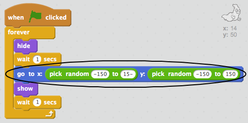

## Random Ghosts

Sizin xəyalınız ancaq tutmaq asan deyil, çünki hərəkət etməz!

+ Xəyalınıza kod əlavə edə bilərsinizmi ki, eyni mövqedə qalmağınız yox, ekranda təsadüfi mövqedən görünür?

\--- İpuçları \--- \--- ipucu \--- Hər dəfə görünməzdən əvvəl səhnədə `üçün hayaletin` təsadüfi bir mövqeyə çıxmasını istəyirik. \--- / ipucu \--- \--- ipucu \--- Siz istifadə edə bilən iki blok blokları var. Bu bir:  Yoxsa bu bir:  \--- / ipucu \--- \--- ipucu \--- Sizin kodunuz bu şəkildə görünməlidir:  Yoxsa belə ola bilər:  \--- / hint \--- - - / ipuçları \---

\--- çağırış \---

## Çağırış: daha çox təsadüf

Görünməzdən qabaq `həyəcanınızı` rastgele bir müddət gözləyin? Göründüyü hər dəfə təsadüfi ölçüsü təsvir etmək üçün `ölçüsü` blokunu istifadə edə bilərsinizmi? \--- / problem