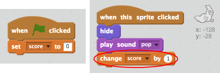

## Hesab əlavə et

Hesab saxlayaraq, hər şeyi daha maraqlı edək!

+ 'Hesab' adlı yeni bir dəyişən yaradın.

[[[generic-scratch-add-variable]]]

+ Oyunçunun hesabını təqib edə bilərsinizmi? Oyunçular onları tutmaq üçün ghosts tıklayarak xal toplamaq lazımdır.
    
    Bir oyunçu bir xəyal üzərinə kliklədikdən sonra onların hesabı artmalıdır.
    
    

\--- ipuçları \--- \--- ipucu \--- `Yaşıl bayrağa`tıklandığında, `hesabınız` dəyişən `olmalıdır 0`. Mərhələ bu kodu əlavə etmək üçün ən yaxşı yerdir. `Hayalet sprite`tıklandığında `puan` `1` tarafından değiştirilmelidir. \--- / hint \--- \--- ipucu \--- İşdə istifadə etmək lazımdır kod blokları:  \--- / hint \--- \--- ipucu \--- Burada ghosts tıklayarak xal toplamaq üçün necə :  \--- / ipucu \--- \--- / ipuçları \---