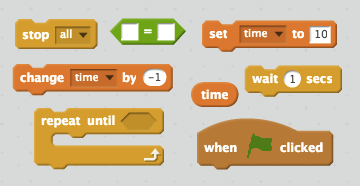

## Taymeri əlavə etmək

+ 'Zaman' adlı yeni bir dəyişən yaradın.

+ Mizkinizə mümkün qədər çox ghosts tutmaq üçün oyunçuya yalnız 10 saniyə vermək üçün bir taymer əlavə edə bilərsinizmi?
    
    Taymeriniz:
    
    + 10 saniyədə başlayın
    + Hər saniyə hesablayın
    
    Taymeri 0-ə çatanda oyun dayandırılmalıdır.

\--- ipuçları \--- \--- ipucu \--- `Yaşıl bayrağa`tıklandığında, `vaxt` değişkeni `10`'e ayarlanmalıdır. It should then `change by -1` every second `until it reaches 0`. \--- / ipucu \--- \--- ipucu \--- İşdə istifadə etmək üçün lazım olan kod blokları:  \--- / hint \--- \--- ipucu \--- İştirakçıya oyun: 

`vaxt = 0` blokunu yaratmaq üçün:  \--- / ipucu \--- \--- / göstərişlər \---

+ Oyununuzu test etmək üçün dostunuzdan soruşun. Nə qədər bal toplaya bilərlər?
    
    Oyununuz çox asandırsa, aşağıdakıları edə bilərsiniz:
    
    + Oyunçunu daha az vaxt verin
    + Hayaletler daha az görünür olun
    + Xəyalları daha kiçik olun
    
    Doğru çətinlik səviyyəsi olduğundan xoşbəxt olduğunuz qədər oyununuzu bir neçə dəfə dəyişdirin və test edin.