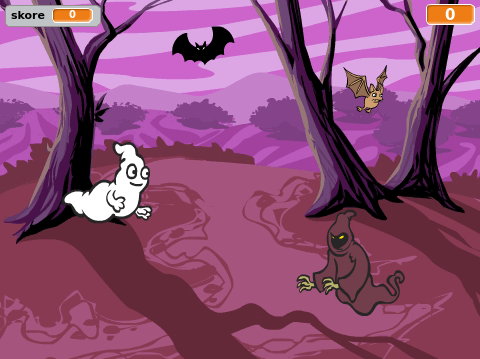

  [Offline Completed Project](resources/Ghostbusters-Finished.sb2){:download='Ghostbusters-Finished.sb2'}
  [Online Completed Project](http://scratch.mit.edu/projects/60787262/#editor){:target="_blank"}

\--- challenge \---

## Výzva: více objektů

Dokážeš přidat do hry další prvky?

Když přidáváš prvek, přemýšlej o následujících věcech.

+ Jak velký bude?
+ Objeví se více či méně často než duch?
+ Jak bude vypadat / znít, když bude chyceno?
+ Kolik bodů získá hráč (nebo ztratí) za jeho chycení?

Pokud potřebuješ pomoci s přidáním dalšího objektu, můžeš znovu použít dříve uvedené kroky!

\--- /challenge \---