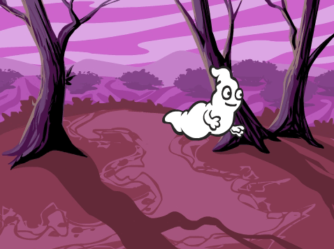
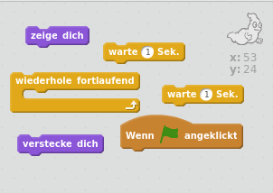
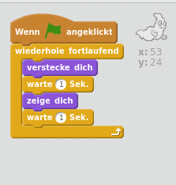

## Ein Gespenst lebendig werden lassen

+ Öffne ein neues Scratch-Projekt.

[[[generic-scratch-new-project]]]

+ Füge eine neue Geister-Figur und einen passenden Bühnenhintergrund hinzu.
    
    

[[[generic-scratch-sprite-from-library]]]

[[[generic-scratch-backdrop-from-library]]]

+ Füge deinem Geist Code hinzu, so dass er sich fortlaufend zeigt und wieder versteckt, wenn du auf die grüne Flagge klickst. Teste und speichere dein Projekt.

\--- hints \--- \--- hint \--- Sobald die `grüne Flagge angeklickt wird`, muss sich dein Gespenst `eine Sekunde` lang `verstecken` und sich dann `eine Sekunde` lang `zeigen`. Es muss dies `fortlaufend` tun. \--- /hint \--- \--- hint \--- Hier sind die Code-Blöcke, die du brauchen wirst:  \--- /hint \--- \--- hint \--- So sollte dein Code aussehen:  \--- /hint \--- \--- /hints \---

[[[generic-scratch-saving]]]