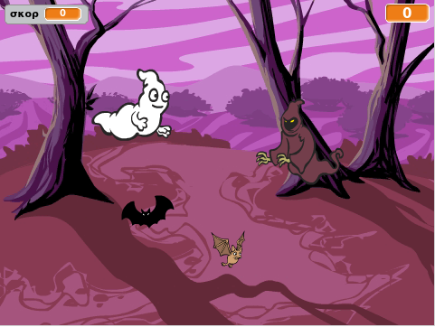

## Εισαγωγή

Πρόκειται να φτιάξεις ένα παιχνίδι για κυνήγι φαντασμάτων!

  <iframe allowtransparency="true" width="485" height="402" src="https://scratch.mit.edu/projects/embed/60787262/?autostart=false" frameborder="0"></iframe>
  

### Additional information for club leaders

Αν χρειαστεί να εκτυπώσεις αυτό το έργο, χρησιμοποίησε την [εκτυπώσιμη έκδοση](https://projects.raspberrypi.org/en/projects/ghostbusters/print).

## \--- collapse \---

## title: Σημειώσεις συντονιστή ομάδας

## Εισαγωγή:

Σε αυτή το έργο, τα παιδιά θα μάθουν πώς να χρησιμοποιούν μεταβλητές για την αποθήκευση δεδομένων στα προγράμματά τους.

## Πόροι

Για το έργο αυτό, θα πρέπει να χρησιμοποιηθεί το Scratch 2. Το Scratch 2 μπορεί είτε να χρησιμοποιηθεί online στο [jumpto.cc/scratch-on](http://jumpto.cc/scratch-on) είτε να μεταφορτωθεί από το [jumpto.cc/scratch-off](http://jumpto.cc/scratch-off) και να χρησιμοποιηθεί εκτός σύνδεσης.

Μπορείς να βρεις μία ολοκληρωμένη έκδοση του έργου [online](http://scratch.mit.edu/projects/60787262/#editor) ή μπορείς να το κατεβάσεις κάνοντας κλικ στο σύνδεσμο «Υλικά έργου» για αυτό το έργο, το οποίο περιέχει:

* Ghostbusters.sb2

## Στόχοι μάθησης

* Μεταβλητές;
* Τυχαίοι αριθμοί.

Αυτό το έργο καλύπτει στοιχεία από τις ακόλουθες πτυχές του [Raspberry Pi Digital Curriculum Making](http://rpf.io/curriculum):

* [Χρησιμοποίησε βασικές δομές προγραμματισμού για να δημιουργήσεις απλά προγράμματα.](https://www.raspberrypi.org/curriculum/programming/creator)

### Additional information for club leaders

If you need to print this project, please use the [Printer friendly version](https://projects.raspberrypi.org/en/projects/ghostbusters/print).

## \--- collapse \---

## title: Club leader notes

## Introduction:

In this project, children will learn how to use variables to store data in their programs.

## Resources

For this project, Scratch 2 should be used. Scratch 2 can either be used online at [jumpto.cc/scratch-on](http://jumpto.cc/scratch-on) or can be downloaded from [jumpto.cc/scratch-off](http://jumpto.cc/scratch-off) and used offline.

You can find a completed version of this project [online](http://scratch.mit.edu/projects/60787262/#editor), or it can be downloaded by clicking the 'Project Materials' link for this project, which contains:

* Ghostbusters.sb2

## Learning Objectives

* Variables;
* Random numbers.

This project covers elements from the following strands of the [Raspberry Pi Digital Making Curriculum](http://rpf.io/curriculum):

* [Use basic programming constructs to create simple programs.](https://www.raspberrypi.org/curriculum/programming/creator)

## Challenges

* "More randomness" - using random numbers;
* "Adding a sound" - consolidating the learning of sounds;
* "More objects" - applying skills to create another game object.

## Frequently Asked Questions

* If children find it difficult to click the ghosts without dragging them around, they can play the game in fullscreen mode, in which ghosts aren't draggable.

\--- /collapse \---

## \--- collapse \---

## title: Project materials

## Club leader resources

* [Downloadable completed Scratch 2 project](resources/Ghostbusters.sb2)
* [Online completed Scratch 2 project](http://scratch.mit.edu/projects/60787262/#editor) \--- /collapse \---