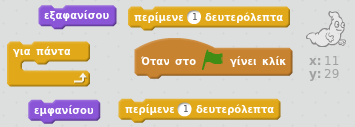
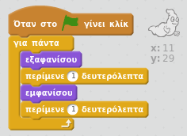

## Ζωντανεύοντας ένα φάντασμα

+ Άνοιξε ένα νέο έργο στο Scratch.

[[[generic-scratch-new-project]]]

+ Πρόσθεσε ένα νέο αντικείμενο-φάντασμα και ένα κατάλληλο υπόβαθρο σκηνικού.
    
    

[[[generic-scratch-sprite-from-library]]]

[[[generic-scratch-backdrop-from-library]]]

+ Πρόσθεσε κώδικα στο φάντασμά σου ώστε να εμφανίζεται και να εξαφανίζεται ασταμάτητα όταν κάνεις κλικ στη σημαία. Δοκίμασε και αποθήκευσε το έργο σου.

\--- hints \--- \--- hint \--- Μόλις `πατηθεί η πράσινη σημαία`, θα πρέπει να κάνεις το φάντασμα `να εξαφανίζεται` για `ένα δευτερόλεπτο` και στη συνέχεια `να εμφανίζεται` για `ένα δευτερόλεπτο`. Αυτό θα πρέπει να το κάνει `για πάντα`. \--- /hint \--- \--- hint \--- Εδώ είναι τα μπλοκ κώδικα που θα χρειαστείτε:  \--- /hint \--- \--- hint \--- Έτσι πρέπει να είναι ο κώδικάς σας:  \--- /hint \--- \--- /hints \---

[[[generic-scratch-saving]]]