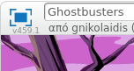
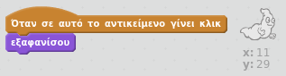

## Πιάνοντας φαντάσματα

Ας επιτρέψεις στον παίκτη να πιάνει φαντάσματα!

+ Μπορείς να κάνεις το φάντασμα να εξαφανίζεται όταν πιαστεί;

Θα πρέπει να μπορείς να κάνεις κλικ στα φαντάσματα για να τα πιάσεις. Εάν διαπιστώσεις ότι αυτό είναι δύσκολο, μπορείς να παίξεις το παιχνίδι σε λειτουργία πλήρους οθόνης κάνοντας κλικ σε αυτό το κουμπί:

\--- hints \--- \--- hint \--- `Όταν πατηθεί`, το φάντασμα θα πρέπει να `κρυφτεί`. \--- /hint \--- \--- hint \--- Ο κώδικάς σου θα πρέπει να είναι έτσι:  \--- /hint \--- \--- /hints \---

\--- challenge \---

## Πρόκληση: προσθέτοντας έναν ήχο

Μπορείς να κάνεις το φάντασμα να κάνει έναν ήχο κάθε φορά που πιάνεται; \--- /challenge \---