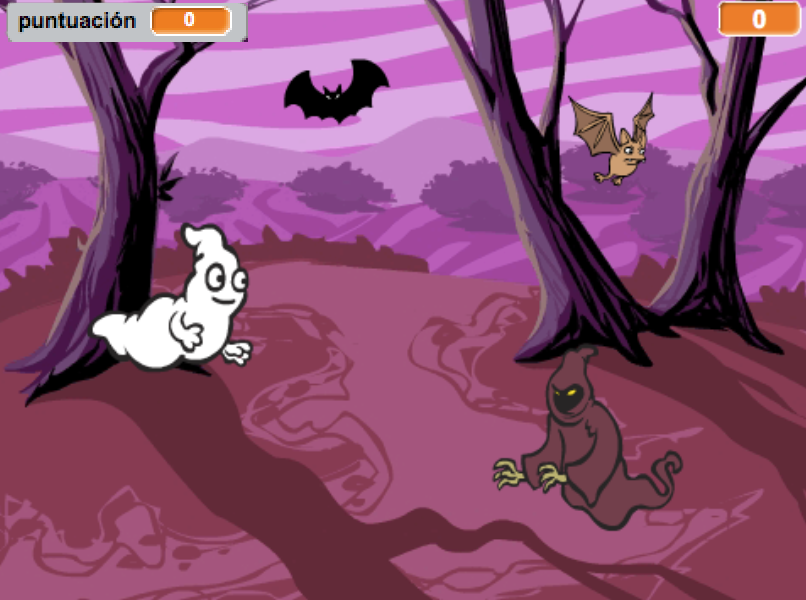
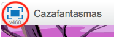

## Introducción

¡Vas a hacer un juego de atrapar fantasmas!

  <iframe allowtransparency="true" width="485" height="402" src="https://scratch.mit.edu/projects/embed/60787262/?autostart=false" frameborder="0"></iframe>
  

### Información adicional para los líderes del club

Si necesitas imprimir este proyecto, usa la [versión para imprimir](https://projects.raspberrypi.org/en/projects/ghostbusters/print).

## \--- collapse \---

## title: Notas para el líder del club

## Introducción:

En este proyecto los niños aprenderán cómo utilizar variables para almacenar datos en sus programas.

## Recursos

Para este proyecto, se debe usar Scratch 2. Scratch 2 se puede usar en línea en [jumpto.cc/scratch-on](http://jumpto.cc/scratch-on) o se puede descargar desde [jumpto.cc/scratch-off](http://jumpto.cc/scratch-off) para usarlo sin conexión.

Puedes encontrar una versión completa de este proyecto [en línea](http://scratch.mit.edu/projects/60787262/#editor) o puedes descargarlo haciendo clic en el enlace 'Materiales del proyecto', que contiene:

* Ghostbusters.sb2

## Objetivos del Aprendizaje

* Variables;
* Números aleatorios.

Este proyecto incluye elementos de los siguientes aspectos del [Currículo de creación digital de Raspberry Pi](http://rpf.io/curriculum):

* [Usa estructuras de programación básicas para crear programas simples.](https://www.raspberrypi.org/curriculum/programming/creator)

### Información adicional para los líderes del club

Si necesitas imprimir este proyecto, usa la [versión para imprimir](https://projects.raspberrypi.org/en/projects/ghostbusters/print).

## \--- collapse \---

## title: Notas para el líder del club

## Introducción:

En este proyecto los niños aprenderán cómo utilizar variables para almacenar datos en sus programas.

## Recursos

Para este proyecto, se debe usar Scratch 2. Scratch 2 se puede usar en línea en [jumpto.cc/scratch-on](http://jumpto.cc/scratch-on) o se puede descargar desde [jumpto.cc/scratch-off](http://jumpto.cc/scratch-off) para usarlo sin conexión.

Puedes encontrar una versión completa de este proyecto [en línea](http://scratch.mit.edu/projects/60787262/#editor) o puedes descargarlo haciendo clic en el enlace 'Materiales del proyecto', que contiene:

* Ghostbusters.sb2

## Objetivos del Aprendizaje

* Variables;
* Números aleatorios.

Este proyecto incluye elementos de los siguientes aspectos del [Currículo de creación digital de Raspberry Pi](http://rpf.io/curriculum):

* [Usa estructuras de programación básicas para crear programas simples.](https://www.raspberrypi.org/curriculum/programming/creator)

## Challenges

* "Más aleatoriedad": usar números aleatorios;
* "Añadir un sonido": consolidar el aprendizaje de sonidos;
* "Más objetos": aplicar habilidades para crear otro objeto del juego.

## Preguntas frecuentes

* Si los niños encuentran difícil hacer clic en los fantasmas sin arrastrarlos, pueden jugar el juego en modo de pantalla completa, en el que los fantasmas no se pueden arrastrar.

\--- /collapse \---

## \--- collapse \---

## title: Materiales del proyecto

## Recursos del líder del club

* [Proyecto Scratch 2 completado descargable](resources/Ghostbusters.sb2)
* [ Proyecto en línea Scratch 2 completado ](http://scratch.mit.edu/projects/60787262/#editor) \--- /colapse \---