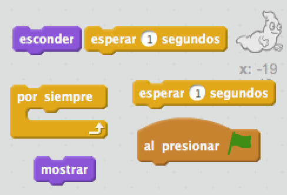
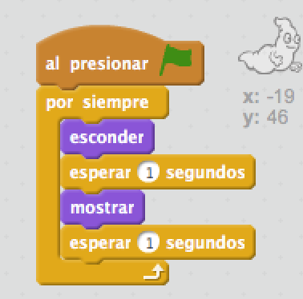

## Animación de un fantasma

+ Abrir un nuevo proyecto de Scratch vacío.

[[[generic-scratch-new-project]]]

+ Añadir un nuevo sprite de fantasma y un fondo de escenario adecuado.
    
    

[[[generic-scratch-sprite-from-library]]]

[[[generic-scratch-backdrop-from-library]]]

+ Añade un código a tu fantasma para que siempre aparezca y desaparezca cuando hagas clic en la bandera verde. Prueba y guarda tu proyecto.

\--- hints \--- \--- hint \--- Una vez que `se hace clic en la bandera verde`, necesitarás hacer que tu fantasma `esconder` por `un segundo`y luego `mostrar` por `un segundo`. Es necesario que lo repita `por siempre`. \--- /hint \--- \--- hint \--- Aquí están los bloques de código que necesitarás:  \--- /hint \--- \--- hint \--- Así es como debería ser tu código:  \--- /hint \--- \--- /hints \---

[[[generic-scratch-saving]]]