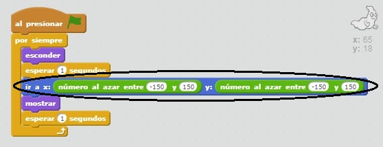

## Fantasmas aleatorios

¡Tu fantasma es muy fácil de atrapar en este momento, porque no se mueve!

+ ¿Puedes agregar código a tu fantasma para que, en lugar de permanecer en la misma posición, aparezca en posiciones aleatorias en la pantalla?

\--- hints \--- \--- hint \--- Quieres que tu fantasma `vaya a` una posición aleatoria en el escenario antes de aparecer cada vez. \--- /hint \--- \--- hint \--- Hay dos conjuntos de bloques de código que puedes usar. Éste:  O éste:  \--- /hint \--- \--- hint \--- Tu código debería ser así:  O podría ser así:  \--- /hint \--- \--- /hints \---

\--- challenge \---

## Challenge: más aleatoriedad

¿Puedes hacer que tu fantasma ` espere ` una cantidad aleatoria de tiempo antes de aparecer? ¿Puedes utilizar el bloque `fijar tamaño` para hacer que tu fantasma tenga un tamaño al azar cada vez que aparece? \--- /challenge \---