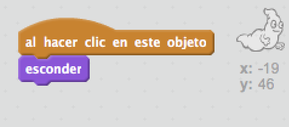

## Atrapar fantasmas

¡Permitamos que el jugador atrape fantasmas!

+ ¿Puedes hacer que tu fantasma desaparezca cuando lo atrapen?

Deberías poder hacer clic en fantasmas para atraparlos. Si encuentras que la captura es difícil, puedes jugar al juego en modo de pantalla completa haciendo clic en este botón:

\--- hints \--- \--- hint \--- `Al hacer clic en este objeto`, tu fantasma debería `esconderse`. \--- /hint \--- \--- hint \--- Tu código debería ser así:  \--- /hint \--- \--- /hints \---

\--- challenge \---

## Challenge: añadir un sonido

¿Puedes hacer que tu fantasma haga un sonido cada vez que es atrapado? \--- /challenge \---