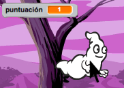
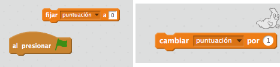
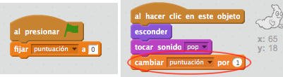

## Añadir una puntuación

¡Vamos a hacer las cosas más interesantes añadiendo una puntuación!

+ Crea una nueva variable llamada 'puntuación'.

[[[generic-scratch-add-variable]]]

+ ¿Puedes llevar la cuenta de la puntuación del jugador? Los jugadores deben ganar puntos haciendo clic en fantasmas para atraparlos.
    
    Cada vez que un jugador hace clic en un fantasma, su puntuación debería aumentar.
    
    

\--- hints \--- \--- hint \--- `Cuando se hace clic en la bandera verde`, tu variable`puntuación` debería `fijarse en 0`. El escenario es el mejor lugar para añadir este código. ` Cuando se hace clic en el sprite fantasma `, la `puntuación ` debería ser ` cambiada por 1 `. \--- /hint \--- \--- hint \--- Aquí están los bloques de código que necesitarás:  \--- /hint \--- \--- hint \--- Aquí está cómo ganar puntos haciendo clic en los fantasmas:  \--- /hint \--- \--- /hints \---