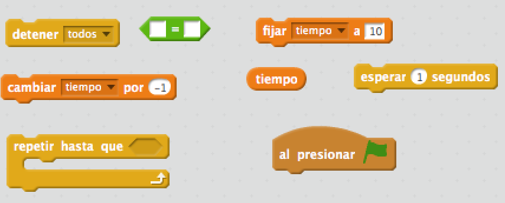
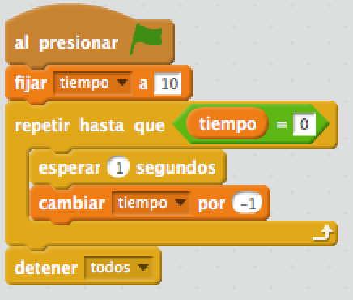
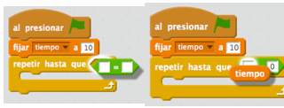

## Añadir un temporizador

+ Crea una nueva variable llamada 'tiempo'.

+ ¿Puedes añadir un temporizador a tu escenario para darle a tu jugador solo 10 segundos para atrapar tantos fantasmas como sea posible?
    
    Tu temporizador debe:
    
    + Comienzar en 10 segundos
    + Reducirse cada segundo
    
    El juego debería detenerse cuando el temporizador llegue a 0.

\--- hints \--- \--- hint \--- `Cuando se hace clic en la bandera verde`, tu variable`tiempo` debería `fijarse en 10`. Entonces debería ` cambiar por -1 ` cada segundo ` hasta que llegue a 0 `. \--- /hint \--- \--- hint \--- Aquí están los bloques que necesitarás:  \--- /hint \--- \--- hint \--- Aquí está cómo añadir un temporizador a tu juego: 

Y así se crea el bloque de `tiempo = 0`:  \--- /hint \--- \--- /hints \---

+ Pídele a un amigo que pruebe tu juego. ¿Cuántos puntos pueden ganar?
    
    Si tu juego es demasiado fácil, puedes:
    
    + Dar al jugador menos tiempo
    + Hacer que los fantasmas aparezcan con menos frecuencia
    + Hacer los fantasmas más pequeños
    
    Cambia y prueba tu juego varias veces hasta que estés seguro de que tiene el nivel de dificultad adecuado.