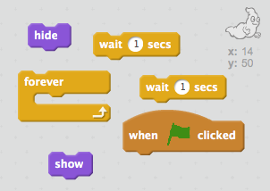

## Aaveiden animointi

+ Avaa uusi tyhjä Scratch-projekti.

[[[generic-scratch-new-project]]]

+ Lisää uusi aave sprite ja sopiva vaiheessa taustalla.
    
    

[[[generic-scratch-sprite-from-library]]]

[[[generic-scratch-backdrop-from-library]]]

+ Lisää koodi aaveeseesi niin, että se näkyy ja katoaa ikuisesti, kun napsautat lippua. Testaa ja tallenna projekti.

\--- vinkit \--- \--- vinkki \--- Kun `vihreä lippu napsautetaan`, sinun täytyy tehdä aaveesi `piilottaa` `sekunnin` ja sitten `näyttää` `sekunnin`. Tämän täytyy tehdä `ikuisesti`. \--- / hint \--- \--- vinkki \--- Seuraavassa on tarvitsemasi koodilohkot:  \--- / hint \--- \--- vinkki \--- Tätä koodisi pitäisi näyttää:  \--- / hint \--- \--- / vinkit \---

[[[generic-scratch-saving]]]