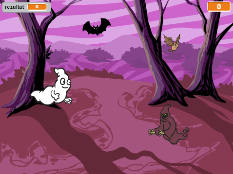

## Uvod

Napravit ćeš igru hvatanja duhova!

  <iframe allowtransparency="true" width="485" height="402" src="https://scratch.mit.edu/projects/embed/60787262/?autostart=false" frameborder="0"></iframe>
  

### Dodatne informacije za voditelje Kluba

Ako trebate ispisati ovaj projekt, koristite [verziju koja je prilagođena pisaču](https://projects.raspberrypi.org/en/projects/ghostbusters/print).

## \--- collapse \---

## title: Bilješke za voditelje Kluba

## Uvod:

U ovom projektu djeca će naučiti kako koristiti varijable za spremanje podataka u svoje programe.

## Resursi

Za ovaj projekt treba koristiti Scratch 2. Scratch 2 se može koristiti online na [ jumpto.cc/scratch-on ](http://jumpto.cc/scratch-on) ili se može preuzeti s [ jumpto.cc/scratch-off ](http://jumpto.cc/scratch-off) i koristiti offline.

Dovršenu verziju ovog projekta možete pronaći [online](http://scratch.mit.edu/projects/60787262/#editor) ili preuzeti na poveznici 'Project Materials' koja sadrži:

* Ghostbusters.sb2

## Ishodi učenja

* Varijable;
* Nasumični brojevi.

Ovaj projekt pokriva elemente iz sljedećih dijelova kurikuluma [Raspberry Pi Digital Making Curriculum](http://rpf.io/curriculum):

* [Korištenje osnova programiranja za izradu jednostavnih programa.](https://www.raspberrypi.org/curriculum/programming/creator)

### Dodatne informacije za voditelje Kluba

Ako trebate ispisati ovaj projekt, koristite [verziju koja je prilagođena pisaču](https://projects.raspberrypi.org/en/projects/ghostbusters/print).

## \--- collapse \---

## title: Bilješke za voditelje Kluba

## Uvod:

U ovom projektu djeca će naučiti kako koristiti varijable za spremanje podataka u svoje programe.

## Resursi

Za ovaj projekt treba koristiti Scratch 2. Scratch 2 se može koristiti online na [ jumpto.cc/scratch-on ](http://jumpto.cc/scratch-on) ili se može preuzeti s [ jumpto.cc/scratch-off ](http://jumpto.cc/scratch-off) i koristiti offline.

Dovršenu verziju ovog projekta možete pronaći [online](http://scratch.mit.edu/projects/60787262/#editor) ili preuzeti na poveznici 'Project Materials' koja sadrži:

* Ghostbusters.sb2

## Ishodi učenja

* Varijable;
* Nasumični brojevi.

Ovaj projekt pokriva elemente iz sljedećih dijelova kurikuluma [Raspberry Pi Digital Making Curriculum](http://rpf.io/curriculum):

* [Korištenje osnova programiranja za izradu jednostavnih programa.](https://www.raspberrypi.org/curriculum/programming/creator)

## Izazovi

* "Više nasumičnosti" - korištenje nasumičnih brojeva;
* "Dodavanje zvuka" - povezivanje s naučenim o zvukovima;
* "Više objekata" - primjena vještina za stvaranje drugog objekta igre.

## Često postavljana pitanja

* Ako djeca imaju problema s klikanjem na duhove bez povlačenja, mogu igrati igru ​​u načinu rada preko cijelog zaslona, ​​u kojem se duhovi ne mogu povlačiti.

\--- /collapse \---

## \--- collapse \---

## title: Materijali projekta

## Materijali za voditelja Kluba

* [Dovršeni Scratch 2 projekt dostupan za preuzimanje](resources/Ghostbusters.sb2)
* [Dovršeni online Scratch 2 projekt](http://scratch.mit.edu/projects/60787262/#editor) \--- /collapse \---