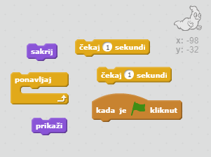
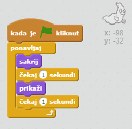

## Animacija duha

+ Otvorite novi prazan Scratch projekt.

[[[generic-scratch-new-project]]]

+ Dodaj novog lika duha i prikladnu pozadinu.
    
    

[[[generic-scratch-sprite-from-library]]]

[[[generic-scratch-backdrop-from-library]]]

+ Dodaj sljedeće naredbe liku duha tako da se on neprestano pojavljuje i nestaje kada klikneš na zelenu zastavicu. Testiraj i spremi projekt.

\--- hints \--- \--- hint \--- Nakon što `klikneš na zelenu zastavicu` moraš svog duha `sakriti` na `jednu sekundu`, a zatim ga `prikazati` na `jednu sekundu`. Duh mora ovo ponavljati `neprestano`. \--- /hint \--- \--- hint \--- Trebat će ti sljedeći blokovi kôda:  \--- /hint \--- \--- hint \--- Ovako bi tvoj kôd trebao izgledati:  \--- /hint \--- \--- /hints \---

[[[generic-scratch-saving]]]