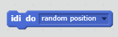
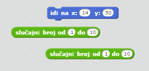
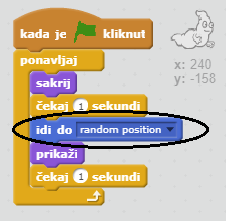
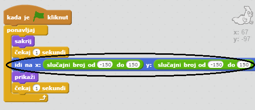

## Duh se pojavljuje na nasumičnim mjestima

Ovog duha je jako lako uhvatiti jer je nepomičan!

+ Možeš li dodati kôd svom duhu tako da se pojavljuje na nasumičnim mjestima na ekranu umjesto da stoji na istom mjestu?

\--- hints \--- \--- hint \--- You want your ghost to `go to` a random position on the stage before appearing each time. \--- /hint \--- \--- hint \--- There are two sets of code blocks you can use. Ovaj:  Ili ovaj:  \--- /hint \--- \--- hint \--- Tvoj kôd bi treba izgledati ovako:  Ili ovako:  \--- /hint \--- \--- /hints \---

\--- challenge \---

## Izazov: više nasumičnosti

Možeš li napraviti promjene u naredbi `čekaj` tako da duh čeka neko vrijeme prije nego što se pojavi? Možeš li koristiti naredbu `postavi veličinu` tako da duh bude različite veličine svaki puta kada se pojavi? \--- /challenge \---