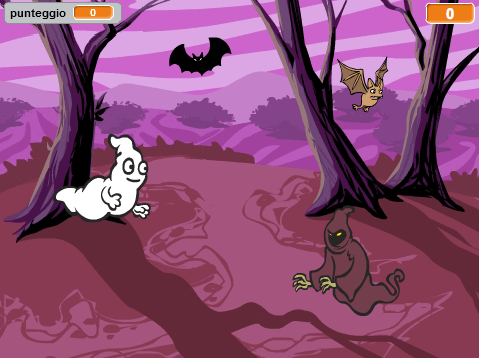

## Introduzione

Stai per creare un gioco di acchiappa-fantasmi!

  <iframe allowtransparency="true" width="485" height="402" src="https://scratch.mit.edu/projects/embed/60787262/?autostart=false" frameborder="0"></iframe>
  

### Additional information for club leaders

Se intendete stampare questo progetto, cliccate su [Versione stampabile](https://projects.raspberrypi.org/en/projects/ghostbusters/print).

## \--- collapse \---

## title: Note per i volontari

## Introduzione:

In questo progetto, i bambini impareranno ad usare le variabili per immagazzinare i dati nei loro programmi.

## Risorse

Per questo progetto, andrebbe usato Scratch 2. Scratch 2 può essere usato online su [jumpto.cc/scratch-on](http://jumpto.cc/scratch-on) oppure può essere scaricato da [jumpto.cc/scratch-off](http://jumpto.cc/scratch-off) ed essere usato in modalità offline.

Una versione completa di questo progetto può essere trovata [online](http://scratch.mit.edu/projects/60787262/#editor), o può essere scaricata cliccando il link ‘Materiali del Progetto’, che contiene:

* Ghostbusters.sb2

## Obiettivi di apprendimento

* Variabili;
* Numeri a caso.

Questo progetto include elementi tratti dalle seguenti componenti del [Digital Making Curriculum di Raspberry Pi](http://rpf.io/curriculum):

* [Utilizzare i costrutti base di un linguaggio di programmazione per creare programmi semplici.](https://www.raspberrypi.org/curriculum/programming/creator)

### Additional information for club leaders

If you need to print this project, please use the [Printer friendly version](https://projects.raspberrypi.org/en/projects/ghostbusters/print).

## \--- collapse \---

## title: Club leader notes

## Introduction:

In this project, children will learn how to use variables to store data in their programs.

## Resources

For this project, Scratch 2 should be used. Scratch 2 can either be used online at [jumpto.cc/scratch-on](http://jumpto.cc/scratch-on) or can be downloaded from [jumpto.cc/scratch-off](http://jumpto.cc/scratch-off) and used offline.

You can find a completed version of this project [online](http://scratch.mit.edu/projects/60787262/#editor), or it can be downloaded by clicking the 'Project Materials' link for this project, which contains:

* Ghostbusters.sb2

## Learning Objectives

* Variables;
* Random numbers.

This project covers elements from the following strands of the [Raspberry Pi Digital Making Curriculum](http://rpf.io/curriculum):

* [Use basic programming constructs to create simple programs.](https://www.raspberrypi.org/curriculum/programming/creator)

## Challenges

* "More randomness" - using random numbers;
* "Adding a sound" - consolidating the learning of sounds;
* "More objects" - applying skills to create another game object.

## Frequently Asked Questions

* If children find it difficult to click the ghosts without dragging them around, they can play the game in fullscreen mode, in which ghosts aren't draggable.

\--- /collapse \---

## \--- collapse \---

## title: Project materials

## Club leader resources

* [Downloadable completed Scratch 2 project](resources/Ghostbusters.sb2)
* [Online completed Scratch 2 project](http://scratch.mit.edu/projects/60787262/#editor) \--- /collapse \---