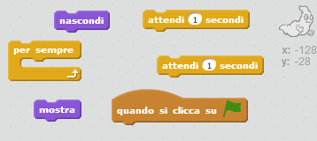
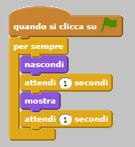

## Animare un fantasma

+ Avvia un nuovo progetto Scratch.

[[[generic-scratch-new-project]]]

+ Aggiungi un nuovo sprite fantasma e uno scenario adatto a questo personaggio.
    
    

[[[generic-scratch-sprite-from-library]]]

[[[generic-scratch-backdrop-from-library]]]

+ Aggiungi dei codici al tuo fantasma, in modo che appaia e scompaia ripetutamente quando fai click sulla bandierina. Prova il tuo codice e salvalo.

\--- hints \--- \--- hint \--- `Quando clicchi su ⚑`, dovrai fare in modo che il tuo fantasma `sparisca` per `un secondo` e poi `ricompaia` per `un secondo`. Dovrà fare ciò `per sempre`. \--- /hint \--- \--- hint \--- Ecco di quali blocchi di codice avrai bisogno:  \--- /hint \--- \--- hint \--- Ecco come dovrebbe apparire il tuo codice:  \--- /hint \--- \--- /hints \---

[[[generic-scratch-saving]]]