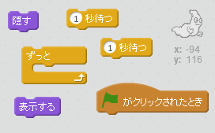
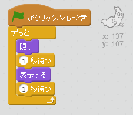

## ゴーストのアニメーション

+ からっぽのScratchプロジェクトを新しく開きます。

[[[generic-scratch-new-project]]]

+ おばけのスプライトとふさわしい背景（はいけい）を追加します。
    
    

[[[generic-scratch-sprite-from-library]]]

[[[generic-scratch-backdrop-from-library]]]

+ フラッグをクリックするといつまでも、おばけがあらわれたり、消えたりするようにコードを入れてみましょう。テストして保存しましょう。

\--- hints \--- \--- hint \--- `グリーンフラッグがクリックされた時`、 おばけは`1秒`のあいだ`かくれて`、`1秒`のあいだ`あらわれます`。 これを `ずっと`くり返します。 \--- /hint \--- \--- hint \--- 使うブロックはこちらです。  \--- /hint \--- \--- hint \--- コードの見本はこちらです。  \--- /hint \--- \--- /hints \---

[[[generic-scratch-saving]]]