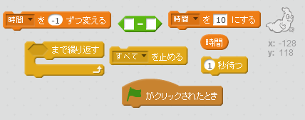
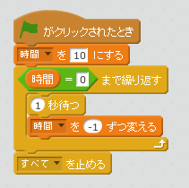
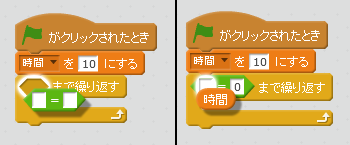

## タイマーの追加

+ '時間'という変数を新しく作成します。

+ たった10秒の間にどれだけたくさんのおばけをつかまえられるように、ステージにタイマーを追加できますか？
    
    あなたのタイマーは：
    
    + 10秒から開始
    + 毎秒カウントダウンする
    
    タイマーが0になると、ゲームは停止します。

\--- hints \--- \--- hint \--- `グリーンフラッグがクリックされた時`、 `時間` 変数は`10になります`。 `0になるまで`1秒ごとに、`-1ずつ変わります`. \--- /hint \--- \--- hint \--- 使うブロックはこちらです。  \--- /hint \--- \--- hint \--- タイマーを追加するには、こうします。 

`時間 = 0`ブロックを作成する方法です。  \--- /hint \--- \--- /hints \---

+ 友達にゲームを遊んでもらいましょう。何点とれるでしょうか？
    
    ゲームがかんたんすぎるようでしたら、こんな風にしてみましょう。
    
    + 時間を短くする
    + おばけをあらわれにくくする
    + おばけを小さくする
    
    満足できるむずかしさになるまで、ゲームを変えてテストしましょう。