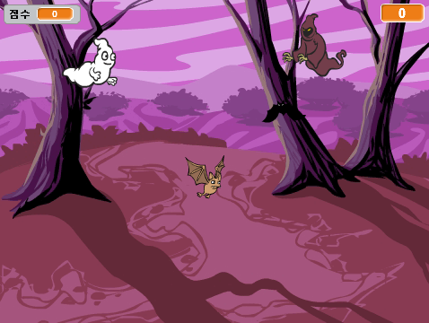

## 소개

이제부터 유령 잡기 게임을 만들어 봅시다!

  <iframe allowtransparency="true" width="485" height="402" src="https://scratch.mit.edu/projects/embed/60787262/?autostart=false" frameborder="0"></iframe>
  

### Additional information for club leaders

이 프로젝트를 인쇄하려면 [프린트용 문서](https://projects.raspberrypi.org/en/projects/ghostbusters/print)를 사용하십시오.

## \--- collapse \---

## title: 교육자 노트

## 소개

이 프로젝트에서 아이들은 변수를 사용하여 프로그램에 데이터를 저장하는 방법을 배우게 됩니다.

## 자료

이 프로젝트에서는 Scratch 2를 사용합니다. Scratch 2는 [jumpto.cc/scratch-on](http://jumpto.cc/scratch-on)에서 온라인으로 사용하거나 [jumpto.cc/scratch-off](http://jumpto.cc/scratch-off)에서 내려받을 수 있습니다.

이 프로젝트의 완성 버전을 [온라인](http://scratch.mit.edu/projects/60787262/#editor)에서 확인하거나, '프로젝트 자료' 링크를 클릭하여 아래의 파일을 내려받을 수 있습니다.

* Ghostbusters.sb2

## 학습 목표

* 변수
* 무작위 숫자(난수)

이 프로젝트는 [라즈베리파이 디지털 메이킹 커리큘럼](http://rpf.io/curriculum) 중 다음 과정에 대한 내용을 다룹니다.

* [기본 프로그래밍 문법으로 간단한 프로그램 만들기](https://www.raspberrypi.org/curriculum/programming/creator)

### Additional information for club leaders

If you need to print this project, please use the [Printer friendly version](https://projects.raspberrypi.org/en/projects/ghostbusters/print).

## \--- collapse \---

## title: Club leader notes

## Introduction:

In this project, children will learn how to use variables to store data in their programs.

## Resources

For this project, Scratch 2 should be used. Scratch 2 can either be used online at [jumpto.cc/scratch-on](http://jumpto.cc/scratch-on) or can be downloaded from [jumpto.cc/scratch-off](http://jumpto.cc/scratch-off) and used offline.

You can find a completed version of this project [online](http://scratch.mit.edu/projects/60787262/#editor), or it can be downloaded by clicking the 'Project Materials' link for this project, which contains:

* Ghostbusters.sb2

## Learning Objectives

* Variables;
* Random numbers.

This project covers elements from the following strands of the [Raspberry Pi Digital Making Curriculum](http://rpf.io/curriculum):

* [Use basic programming constructs to create simple programs.](https://www.raspberrypi.org/curriculum/programming/creator)

## Challenges

* "More randomness" - using random numbers;
* "Adding a sound" - consolidating the learning of sounds;
* "More objects" - applying skills to create another game object.

## Frequently Asked Questions

* If children find it difficult to click the ghosts without dragging them around, they can play the game in fullscreen mode, in which ghosts aren't draggable.

\--- /collapse \---

## \--- collapse \---

## title: Project materials

## Club leader resources

* [Downloadable completed Scratch 2 project](resources/Ghostbusters.sb2)
* [Online completed Scratch 2 project](http://scratch.mit.edu/projects/60787262/#editor) \--- /collapse \---