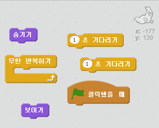
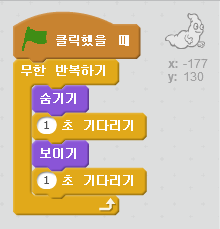

## 유령 움직여 보기

+ 새 스크래치 프로젝트 만들기

[[[generic-scratch-new-project]]]

+ Add in a new ghost sprite and a suitable stage backdrop.
    
    

[[[generic-scratch-sprite-from-library]]]

[[[generic-scratch-backdrop-from-library]]]

+ 깃발을 클릭했을 때 유령이 계속 나타났다 사라지도록 코드를 추가하세요.

\--- hints \--- \--- hint \--- `녹색 깃발을 클릭하면` 유령이 `1초`동안 `숨었다가` `1초`동안 `나타나도록` 만들어야 합니다. 이 작업이 `무한히 반복`돼야 합니다. \--- /hint \--- \--- hint \--- 필요한 코드 블럭은 다음과 같습니다.  \--- /hint \--- \--- hint \--- 코드는 이런 형태로 만들어져야 합니다.  \--- /hint \--- \--- /hints \---

[[[generic-scratch-saving]]]