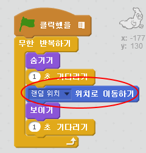

## 무작위 유령들

유령들이 움직이지 않아서 너무 잡기 쉬워요!

+ Can you add code to your ghost so that, instead of staying in the same position, it appears at random positions on the screen?

\--- hints \--- \--- hint \--- You want your ghost to `go to` a random position on the stage before appearing each time. \--- /hint \--- \--- hint \--- There are two sets of code blocks you can use. This one:  Or this one:  \--- /hint \--- \--- hint \--- Your code should look either like this:  Or it can look like this:  \--- /hint \--- \--- /hints \---

\--- challenge \---

## 도전 과제: 더 랜덤하게

Can you make your ghost `wait` a random amount of time before appearing? Can you use the `set size` block to make your ghost a random size each time it appears? \--- /challenge \---