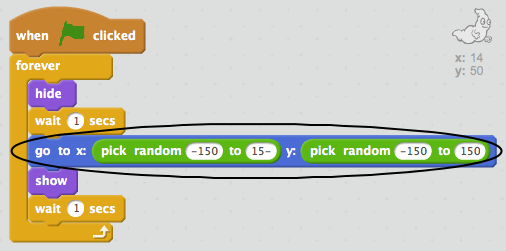

## ക്രമരഹിതമായ പ്രേതം

നിങ്ങളുടെ പ്രേതം നിമിഷം പിടിക്കാൻ വളരെ എളുപ്പമാണ്, കാരണം അത് നീങ്ങുന്നില്ല!

+ നിങ്ങളുടെ പ്രേതത്തിൻറെ കോഡ് നിങ്ങൾക്ക് ചേർക്കാനാകുമോ, അതുപോലെ തന്നെ സമാന സ്ഥാനത്ത് നിൽക്കുന്നതിനുപകരം സ്ക്രീനിൽ ക്രമരഹിതമായ സ്ഥാനത്താണുള്ളത്?

\--- സൂചനകൾ \--- \--- സൂചന \--- നിങ്ങളുടെ പ്രേതം `ലേക്ക് ഓരോ സമയത്തും പ്രത്യക്ഷപ്പെടുന്നതിന് മുമ്പായി ഒരു നിശ്ചിത സ്ഥാനത്ത്` എന്നതിലേക്ക് പോകുക. \--- / hint \--- \--- സൂചന \--- നിങ്ങൾക്ക് ഉപയോഗിക്കാവുന്ന കോഡ് ബ്ലോക്കുകളുടെ രണ്ട് സെറ്റ് ഉണ്ട്. ഇതാണ്:  അല്ലെങ്കിൽ ഇത് ഒന്ന്:  \--- / hint \--- \---- point \--- നിങ്ങളുടെ കോഡ് ഇതുപോലെ ആയിരിയ്ക്കണം:  അല്ലെങ്കിൽ ഇതുപോലെ കാണപ്പെടും:  \--- / / hint \--- \- -- /സൂചനകൾ \---

\--- വെല്ലുവിളി \---

## ചലഞ്ച്: കൂടുതൽ ക്രമരഹിതം

നിങ്ങളുടെ ഭൂതത്തിന് `കാത്തിരിപ്പ്` ഒരു പ്രത്യക്ഷപ്പെടൽ സമയം ദൃശ്യമാക്കാൻ കഴിയുമോ? ഓരോ തവണയും ദൃശ്യമാകുമ്പോഴെല്ലാം നിങ്ങളുടെ പ്രേതം ഒരു ക്രമരഹിത വലുപ്പമുണ്ടാക്കാൻ `സെറ്റ് വ്യാപ്തി` ബ്ലോക്ക് ഉപയോഗിക്കാമോ? \--- / വെല്ലുവിളി \---