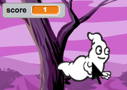

## ഒരു സ്കോർ ചേർക്കുന്നു

സ്കോർ സൂക്ഷിക്കുന്നതിലൂടെ കാര്യങ്ങൾ കൂടുതൽ രസകരമാക്കാം!

+ 'സ്കോർ' എന്ന പുതിയ വേരിയബിൾ സൃഷ്ടിക്കുക.

[[[generic-scratch-add-variable]]]

+ നിങ്ങൾക്ക് പ്ലെയറിന്റെ സ്കോർ ട്രാക്കുചെയ്യാൻ കഴിയുമോ? കളിക്കാർ അവരെ പിടിക്കാൻ പ്രേതങ്ങളെ ക്ലിക്കുചെയ്ത് പോയിന്റുകൾ സ്കോർ ചെയ്യണം.
    
    ഓരോ തവണ കളിക്കാരനായും ഒരു കളിക്കാരൻ ക്ലിക്കുചെയ്യുമ്പോൾ, അവരുടെ സ്കോർ വർദ്ധിക്കും.
    
    

\--- hints \--- \--- hint \--- `പച്ച കൊടി`ക്ലിക്ക് ചെയ്യുമ്പോൾ, നിങ്ങളുടെ `സ്കോർ` വേരിയബിൾ `സെറ്റ്` ആയി സജ്ജീകരിച്ചിരിക്കണം. ഈ കോഡ് ചേർക്കുന്നതിനുള്ള മികച്ച സ്ഥലം സ്റ്റേജാണ്. `When the ghost sprite is clicked`, the `score` should be `changed by 1`. \--- / hint \--- \--- സൂചന \--- നിങ്ങൾ ഉപയോഗിക്കുന്ന കോഡ് ബ്ലോക്കുകൾ ഇതാ:  \--- / സൂചന \--- \--- സൂചന \--- ghosts ക്ലിക്ക് ചെയ്തുകൊണ്ട് പോയിന്റുകൾ സ്കോർ എങ്ങനെ :  \--- / സൂചന \--- \--- / / സൂചനകൾ \---