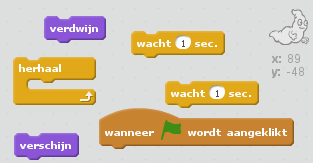
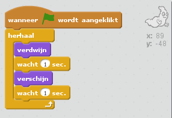

## Beweeg een spook

+ Open een nieuw leeg Scratch-project.

[[[generic-scratch-new-project]]]

+ Voeg een nieuwe Spook Sprite (Ghost) toe, en een geschikte achtergrond.
    
    

[[[generic-scratch-sprite-from-library]]]

[[[generic-scratch-backdrop-from-library]]]

+ Voeg code toe aan je spook zodat die steeds weer verschijnt en verdwijnt als je op de vlag klikt. Test het en sla je project op.

\--- hints \--- \--- hint \--- Wanneer op de `groene vlag is geklikt`, moet je spook `een seconde verdwijnen` en dan `een seconde zichtbaar worden`. Dit zal steeds moeten ` herhalen `. \--- /hint \--- \--- hint \--- Dit zijn de blokken die je nodig hebt:  \--- /hint \--- \--- hint \--- Zo zou het programma eruit moeten zien:  \--- /hint \--- \--- /hints \---

[[[generic-scratch-saving]]]