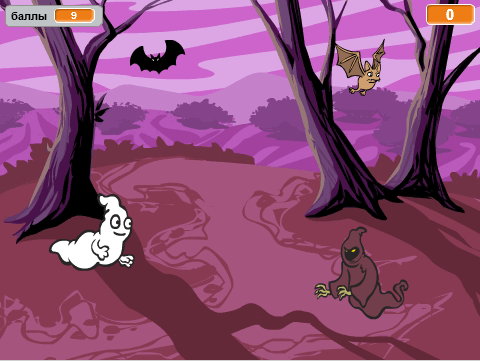

  [Offline Completed Project](resources/Ghostbusters-Finished.sb2){:download='Ghostbusters-Finished.sb2'}
  [Online Completed Project](http://scratch.mit.edu/projects/60787262/#editor){:target="_blank"}

\--- challenge \---

## Задача: больше объектов

Можешь ли ты добавить в твою игру другие объекты?

Когда ты добавляешь объект, тебе нужно подумать о следующем.

+ Насколько он большой?
+ Он будет появляться чаще или реже, чем призрак?
+ Как он будет выглядеть и какой издаст звук, когда будет пойман?
+ Сколько баллов получит (или потеряет) игрок за его поимку?

Если тебе нужна помощь в добавлении другого объекта, то ты можешь повторно использовать приведенные выше шаги!

\--- /challenge \---