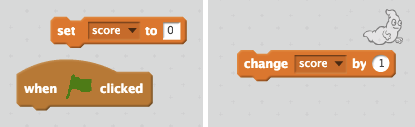

## Dodajanje rezultata

Poskrbimo, da bodo stvari bolj zanimive, tako da ohranimo rezultat!

+ Ustvarite novo spremenljivko, imenovano »score«.

[[[generic-scratch-add-variable]]]

+ Ali lahko spremljate oceno igralca? Igralci morajo doseči točke s klikom na duhove, da jih ujamejo.
    
    Vsakič, ko igralec klikne na duh, se mora njihov rezultat povečati.
    
    

\--- namige \--- \--- nakazilo \--- `Ko kliknete zeleno zastavo`, mora biti `spremenljivka` `nastavljena na 0`. Stage je najboljše mesto za dodajanje te kode. `Ko kliknete ghost sprite`, `rezultat` naj bo `spremenjen z 1`. \--- / namig \--- \--- nasvet \--- Tukaj so bloki kode, ki jih boste morali uporabiti:  \--- / hint \--- \--- namig \--- Tukaj je, kako doseči točke tako, da kliknete duhove :  \--- / namig \--- \--- / namigi \---