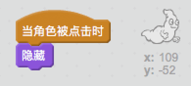

## 捉鬼

让我们的玩家可以捕捉幽灵！

+ Can you make your ghost disappear when it's been caught?

You should be able to click ghosts to catch them. If you find the catching difficult, you can play the game in full-screen mode by clicking this button:

\--- hints \--- \--- hint \--- `When clicked`, your ghost sprite should `hide`. \--- /hint \--- \--- hint \--- Your code should look like this:  \--- /hint \--- \--- /hints \---

\--- challenge \---

## 挑战：添加声音

Can you get your ghost to make a sound each time it's caught? \--- /challenge \---